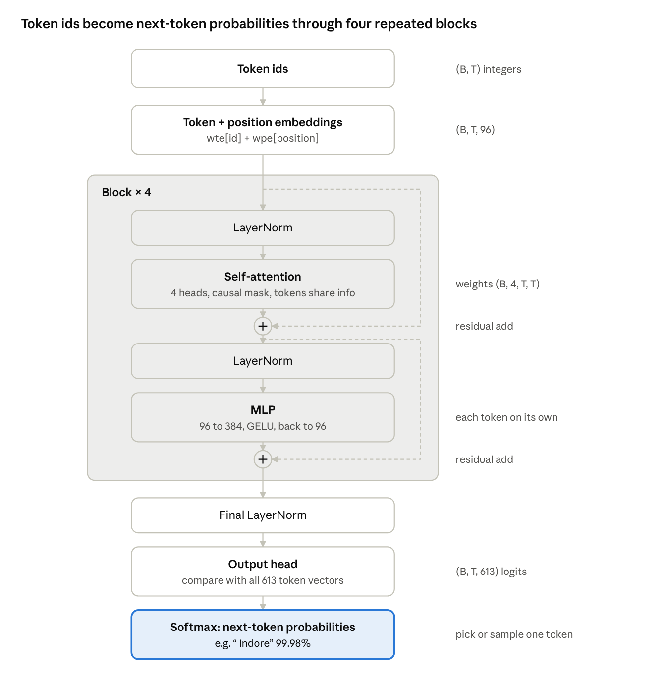

# Disciplina — Complete Code Guide

A line-by-line guide to every file in this project. To install and run it, see [INSTALL.md](INSTALL.md); to see the data, see [DATASET.md](DATASET.md).

## 1. The big picture

**Disciplina** (Latin for *training, instruction*) builds a small GPT-style language model from nothing, using only Python and NumPy, then teaches it to answer questions. Every piece that libraries like PyTorch normally hide (the maths of training) is written by hand, so you can see exactly how an LLM works.

**How to use this guide.** Read it with the project folder open. Each section names a file, shows its important code, and explains it line by line in plain words. Section 14 then follows one question, "Where does Asha live?", through the whole system until the answer "Indore" comes out.

**The story the project tells.** We invent a tiny world of 40 people. Each person has a city, a job and a favourite food. The model learns this world in two stages, exactly like ChatGPT or Claude:

1. **Pre-training (knowledge).** The model reads 4,000 short documents of plain sentences such as "Asha lives in Indore. Ravi loves apples." Its only job is to guess the next word. By doing this millions of times it memorises the facts.
2. **Fine-tuning (behaviour).** The model is then shown 180 question-and-answer pairs such as "Q: Where does Asha live? A: Indore", but only for 30 of the 40 people. It learns the *skill* of answering.
3. **Evaluation (proof).** We ask about the 10 people it never saw in question form. It answers 100% correctly, which proves it learned to pull facts out of its memory rather than memorise answers.

**The seven building blocks**, in the order data flows through them:

1. **Data** (`llm/data.py`): creates the world, the training text and the questions.
2. **Tokenizer** (`llm/tokenizer.py`): turns text into numbers and back.
3. **Model** (`llm/model.py`): the transformer network that predicts the next token.
4. **Training** (`llm/training.py`): the loops that adjust the model's numbers to reduce its mistakes.
5. **Prompts** (`llm/prompts.py`): different ways of asking the same question.
6. **Evaluation and embeddings** (`llm/evaluate.py`, `llm/embeddings.py`): measure how good the model is and what it learned.
7. **Command-line tool** (`main.py`): one entry point with five commands (`train`, `eval`, `chat`, `data`, `test`) that ties everything together.

The diagram below shows how they fit together.


The base model already knows every fact; the two fine-tuned copies add only the skill of answering questions.

## 2. Libraries used, and why

The project uses exactly **one** installed library, NumPy. Everything else comes from Python's standard library, which is built into Python and needs no installation.

### NumPy (the only one you install)

NumPy gives Python fast arrays of numbers (vectors and matrices) and maths on whole arrays at once. A language model is nothing but huge tables of numbers multiplied together, so NumPy does almost all the real work here.

Why we need it: a plain Python loop that multiplies two 1,000 × 1,000 tables would take minutes. NumPy does it in milliseconds, because it runs optimised C code underneath.

The NumPy features this project uses:

| Feature | Example in the code | What it does |
| --- | --- | --- |
| `np.array`, `np.zeros`, `np.ones` | `np.zeros(C)` | Create arrays filled with numbers |
| Matrix multiply `@` | `x @ W` | The core operation of every neural network layer |
| `np.exp`, `np.log`, `np.tanh`, `np.sqrt` | `np.exp(x)` | Maths applied to every element at once |
| `.mean`, `.var`, `.sum`, `.max` | `x.mean(-1)` | Averages and totals along one direction |
| `.reshape`, `.transpose` | `q.reshape(B,T,nh,hd)` | Rearrange an array without changing its numbers |
| Indexing with an array | `P["wte"][idx]` | Look up rows of a table (embeddings) |
| `np.random.default_rng` | `rng.standard_normal(shape)` | Random numbers for starting weights and sampling |
| `np.triu` | the causal mask | A triangle of numbers that hides future words |
| `np.add.at` | embedding gradient | Adds values into repeated positions correctly |
| `np.savez`, `np.load` | `model.save(path)` | Save and load the trained model to a `.npz` file |
| `np.linalg.svd`, `np.linalg.norm` | embedding plot | Find the main directions in data; measure vector length |

### Python standard library (built in)

| Module | Used in | Why we need it |
| --- | --- | --- |
| `re` (regular expressions) | tokenizer | Splits text into words, spaces and punctuation before BPE |
| `json` | tokenizer, model | Saves the tokenizer's merges and the model's settings as text |
| `collections.Counter` | tokenizer | Counts how often each word and each pair of tokens appears |
| `dataclasses` | model | `@dataclass` makes the `GPTConfig` settings class in a few lines |
| `random` | data | Builds the made-up world and random sentences, reproducibly with a seed |
| `argparse` | `main.py` | Reads the command (`train`, `chat`, ...) and options such as `--quick` or `--temperature 0.8` |
| `os` | scripts | Builds file paths that work on Windows and Mac, finds the `artifacts` folder |
| `sys` | `main.py` | Sets UTF-8 printing so symbols like ✓ work on Windows |
| `time` | training | Measures how many seconds training has taken |
| `copy` | `main.py` | `copy.deepcopy(base)` makes an independent copy of the model before fine-tuning it |
| `csv` | `llm/dataset.py` | Writes `data/people.csv`, the table of all facts |

### Why not PyTorch?

Real projects use PyTorch, TensorFlow or JAX. Their main gift is **automatic differentiation**: you write the forward calculation and they work out the backward (learning) calculation for you. That is convenient, but it hides the most important part of how a network learns.

Here we write the backward pass by hand (Section 9) and check it with a test (Section 13). Once you understand this version, PyTorch code will feel easy, because it does the same steps for you. A second, practical reason: NumPy runs on any laptop with no GPU and installs in seconds.

## 3. Project structure

The project has 14 Python files, 4 guides, a folder of data and a folder of results. The `llm` folder is a Python **package**: a folder of related code files that other scripts import with lines like `from llm.model import GPT`. The empty file `llm/__init__.py` is what tells Python "this folder is a package".

```
disciplina/
├── llm/                      the engine: reusable building blocks
│   ├── __init__.py           empty; marks llm/ as a package
│   ├── data.py               the made-up world, training text, Q&A pairs
│   ├── tokenizer.py          BPE tokenizer: text <-> numbers
│   ├── model.py              the GPT transformer, backprop, LoRA, optimiser
│   ├── training.py           pre-training and fine-tuning loops
│   ├── prompts.py            zero-shot / few-shot / completion prompts
│   ├── evaluate.py           perplexity, accuracy, text generation helper
│   ├── embeddings.py         nearest words, category similarity, PCA picture
│   ├── dataset.py            exports data/ and DATASET.md
│   └── plots.py              draws the training-curve charts (SVG)
├── tests/
│   ├── test_gradients.py     proves the hand-written maths is correct
│   ├── test_tokenizer.py     proves encode/decode is lossless
│   └── test_model.py         checks the trained models: 60/60 held-out answers, no forgetting
├── .github/workflows/        runs all tests automatically on every GitHub upload
├── main.py                   the command-line tool: train / eval / chat / data
├── requirements.txt          the one dependency: numpy
├── DATASET.md / GUIDE.md     the dataset page and this guide
├── LICENSE                   MIT licence: anyone may use the code
├── data/                     people.csv + training, validation, fine-tuning, test text
├── docs/images/              the diagrams used in this guide
├── README.md / INSTALL.md    explanation and setup guide
└── artifacts/                everything training produced
    ├── tokenizer.json        the learned BPE merges
    ├── base_model.npz        model after pre-training
    ├── finetuned_full.npz    after full fine-tuning
    ├── finetuned_lora_merged.npz   after LoRA fine-tuning
    ├── results.json, run_log.txt   numbers and log of the run
    ├── pretraining_loss.svg, finetuning_loss.svg   training curves
    └── embeddings_pca.svg    picture of the learned word vectors
```

**Which file depends on which.** Lower files never import higher ones, so you can build and test them in this order:

1. `data.py` and `tokenizer.py` depend on nothing (only the standard library).
2. `model.py` depends only on NumPy.
3. `training.py` and `evaluate.py` use the model.
4. `prompts.py` and `dataset.py` use `data.py`; `embeddings.py` uses the model and tokenizer; `plots.py` uses only NumPy.
5. `main.py` uses everything.

This is also the order of the sections that follow, so you can rebuild the project from scratch by reading top to bottom.

## 4. The maths you need (simply)

You need only six ideas. Each one appears many times in the code.

**1. Vector.** A list of numbers, such as `[0.2, -1.3, 0.7]`. In this project every token is represented by a vector of 96 numbers, called its **embedding**. Think of it as the word's position in a 96-dimensional space.

**2. Matrix and matrix multiply (`@`).** A matrix is a table of numbers. Multiplying a vector by a matrix mixes its numbers into a new vector. If `x` has 96 numbers and `W` is a 96 × 288 table, then `x @ W` has 288 numbers. Each output number is a weighted sum of all inputs. **The "weights" in this table are what the model learns.** Our model has 512,544 such numbers.

**3. Shapes.** The code works on many tokens at once. An array of shape `(B, T, C)` means B sentences in the batch, T tokens in each, and C numbers per token. Most bugs in neural network code are shape mistakes, so the code comments name the shapes.

**4. Softmax: turning scores into probabilities.** The model gives every possible next token a score (called a **logit**). Softmax turns these scores into probabilities that are all positive and add up to 1:

```math
\mathrm{softmax}(z_i) = \frac{e^{z_i}}{\sum_j e^{z_j}}
```

Example: scores \[2, 1, 0\] become probabilities \[0.67, 0.24, 0.09\]. The highest score gets the largest share.

**5. Cross-entropy loss: measuring the mistake.** If the correct next token received probability p, the loss is −log(p). A confident correct answer (p = 0.99) costs 0.01; a confident wrong one (p = 0.01) costs 4.6. Training tries to make this number small. **Perplexity** is e raised to the average loss: "on average the model is choosing between this many tokens". Our untrained model's perplexity is 638 (pure guessing among 613 tokens); trained, it is 2.7.

**6. Gradient and gradient descent: how learning happens.** The gradient of a weight says: "if this weight goes up a tiny bit, how much does the loss go up?" To learn, we move every weight a small step in the opposite direction:

```math
w_{\text{new}} = w - \text{learning rate} \times \frac{\partial\,\text{loss}}{\partial w}
```

Repeat this thousands of times and the loss falls. **Backpropagation** is the method for computing all 512,544 gradients at once, by applying the chain rule of calculus backwards through every layer (Section 9).

That is all. Everything else in the project is these six ideas combined.

## 5. `data.py` — creating the world and the training data

This file makes all the text the model ever sees. We invent our own data so training takes minutes on a laptop, and so we know the true answer to every question.

### The vocabulary of the world

```python
NAMES  = ["Asha", "Ravi", "Meera", ...]          # 40 people
CITIES = ["Pune", "Delhi", "Chennai", ...]       # 10 cities
JOBS   = ["doctor", "teacher", "pilot", ...]     # 10 jobs
FOODS  = ["mangoes", "dosa", "biryani", ...]     # 10 foods
ATTRS  = {"city": CITIES, "job": JOBS, "food": FOODS}
```

Plain Python lists. `ATTRS` is a dictionary that groups the three kinds of fact (called **attributes**) so the code can loop over them.

### Many ways to say the same fact

```python
FACT_TEMPLATES = {
    "city": ["{n} lives in {v}.", "{n} is from {v}.", "The home of {n} is in {v}.", ...],
    "job":  ["{n} works as {a} {v}.", "The job of {n} is {v}.", ...],
    "food": ["{n} loves {v}.", "The favourite food of {n} is {v}.", ...],
}
```

Each template is a sentence with blanks: `{n}` = name, `{v}` = value, `{a}` = "a" or "an". There are 5 phrasings per attribute. **Why so many?** Research on LLMs shows a model can only retrieve a fact flexibly if it saw that fact phrased in different ways during training. With one phrasing it memorises a word sequence, not a fact. `article(word)` simply returns "an" before a vowel ("an engineer") and "a" otherwise.

`QUESTION_TEMPLATES` holds 2 questions per attribute ("Where does {n} live?", "Which city is {n} from?"). `COMPLETION_PROMPTS` holds sentence starts in pre-training style ("{n} lives in"), used later for prompt engineering.

### `build_world(seed=0)`

```python
rng = random.Random(seed)
world = {n: {a: rng.choice(vals) for a, vals in ATTRS.items()} for n in NAMES}
names = NAMES[:]
rng.shuffle(names)
return world, names[:30], names[30:]
```

- `random.Random(seed)` makes a random-number generator. A fixed **seed** means the same "random" world every run, so results are reproducible.
- The one-line "dictionary comprehension" gives each person a random city, job and food. Result: `world["Asha"] = {"city": "Indore", "job": "painter", "food": "mangoes"}`.
- The names are shuffled and split: 30 **train** people (used for fine-tuning) and 10 **held-out** people (used only for testing).

### `pretraining_corpus(world, n_docs=4000)`

Builds 4,000 documents. Each document picks 3 to 6 random (person, attribute) pairs, writes each as a sentence with a random template, and joins them with spaces. Documents are joined with the special marker `<|endoftext|>`. The result is about 572,000 characters of text, like this:

> The home of Vijay is in Mysore. The job of Priya is lawyer. For dinner Harish likes dosa. Neha grew up in Pune.<|endoftext|>Deepak has been an engineer for years...

A second call with a different seed (300 documents) makes the **validation** text: the same facts in new combinations, used to measure progress on text the model did not train on.

### `qa_prompt` and `qa_examples`

```python
def qa_prompt(question):
    return f"Q: {question}\nA:"
```

This fixes the chat format: `Q: <question>`, a new line, then `A:`. `qa_examples(world, people)` returns a list of tuples `(prompt, answer, attr, name)`, for example `("Q: Where does Asha live?\nA:", " Indore", "city", "Asha")`. The answer starts with a space because it follows "A:" in the text. For the 30 train people with both phrasings this gives 30 × 3 × 2 = **180 fine-tuning examples**.

## 6. `tokenizer.py` — turning text into numbers

A neural network can only do maths on numbers, so text must become a list of integers first. The tokenizer does this with **Byte Pair Encoding (BPE)**, the same method used by GPT-2, GPT-4 and Llama.

### Why not just use letters or whole words?

- **Letters only:** sentences become very long, and the model must learn spelling before meaning.
- **Whole words only:** any new word ("Bengaluru") would be unknown, and the vocabulary would be enormous.
- **BPE (the middle way):** common words become one token, rare words are built from smaller pieces. Nothing is ever unknown.

### Step 1: start from bytes

Every character of text is stored as 1 to 4 **bytes** (numbers 0 to 255) in UTF-8. So `"Asha"` is `[65, 115, 104, 97]`. These 256 byte values are the first 256 tokens. Because every possible text is made of bytes, every text can be encoded.

### Step 2: pre-tokenize with a regular expression

```python
PAT = re.compile(r" ?[A-Za-z]+| ?\d| ?[^\sA-Za-z\d]+|\s+(?!\S)|\s+")
```

This pattern splits text into chunks before BPE runs. Read the `|` as "or":

- `  ?[A-Za-z]+ ` = an optional space followed by letters → `" lives"`
- `  ?\d ` = an optional space and one digit
- `  ?[^\sA-Za-z\d]+ ` = punctuation such as `"."` or `"?"`
- `\s+(?!\S)|\s+` = runs of spaces and new lines

So `"Asha lives in Pune."` becomes `["Asha", " lives", " in", " Pune", "."]`. Merges never cross these boundaries, so the tokenizer never invents junk tokens like `"e."` that glue a word to punctuation. Notice that **the space belongs to the word**: `" Pune"` and `"Pune"` are different tokens.

### Step 3: training, `train(text, vocab_size)`

```python
chunk_counts = Counter(PAT.findall(text))
chunks = {tuple(c.encode("utf-8")): n for c, n in chunk_counts.items()}
for i in range(num_merges):
    pair_counts = Counter()
    for ids, n in chunks.items():
        for a, b in zip(ids, ids[1:]):
            pair_counts[(a, b)] += n
    best = max(pair_counts, key=pair_counts.get)
    new_id = 256 + i
    self.merges[best] = new_id
    self.vocab[new_id] = self.vocab[best[0]] + self.vocab[best[1]]
    chunks = {tuple(_merge(list(ids), best, new_id)): n for ids, n in chunks.items()}
```

Line by line:

1. `Counter(PAT.findall(text))` counts each distinct chunk. Our pre-training text has only about 110 distinct chunks, so this is fast even though the text is long.
2. Each chunk is converted to a tuple of byte ids, keeping its count.
3. In every round, `zip(ids, ids[1:])` walks through neighbouring pairs, and each pair's count is increased by how often the chunk occurs.
4. `max(...)` picks the most frequent pair, for example `(32, 105)` = `" "` + `"i"`.
5. That pair gets a new id (256, then 257, …). `self.vocab` remembers its bytes so we can decode later.
6. `_merge` replaces every occurrence of the pair with the new id, and the next round begins.

You can see this when the tokenizer trains with `verbose=True`: `" " + "i"` first (11,547 times), then `" i" + "s"` = `" is"`, then whole words like `" favour"`. The loop stops when no pairs remain (every chunk is a single token). Our vocabulary ended at **613 tokens**: 256 bytes + 356 merges + 1 special token.

### Step 4: the special token

`<|endoftext|>` gets the last id (`self.eot_id`, 612 here). It marks the end of a document and the end of an answer. It is how the fine-tuned model learns to **stop talking**.

### Step 5: encoding, `encode(text)`

The text is first split around `<|endoftext|>`, then into chunks with `PAT`. For each chunk, `_encode_chunk` starts from its bytes and repeatedly applies the pair that was **learned earliest** (lowest new id), until no learned pair is left. Results are cached in `self._cache` so each word is only worked out once.

### Step 6: decoding, `decode(ids)`

```python
return b"".join(self.vocab[i] for i in ids).decode("utf-8", errors="replace")
```

Look up each id's bytes, join them, and convert the bytes back to text. `errors="replace"` shows `�` instead of crashing if a token holds half of a multi-byte character.

### Step 7: save and load

`save` writes the list of merges to `tokenizer.json`. `load` rebuilds the vocabulary from it. The merges are all you need: the tokenizer must be **exactly the same** at training time and chat time, or the token ids would mean different things.

**Worked example from your run:** `"asha lives in pune."` became 8 tokens, while `"Asha lives in Pune."` became 6. Lowercase "pune" never appeared in training, so it was built from pieces: `" p" + "un" + "e"`.

## 7. `model.py` part 1 — settings, weights and the small building blocks

`model.py` is the heart of the project: the transformer itself. This part covers the pieces it is built from; Section 8 assembles them.

### The settings: `GPTConfig`

```python
@dataclass
class GPTConfig:
    vocab_size: int = 512   # how many different tokens exist (613 after training the tokenizer)
    block_size: int = 64    # context length: the most tokens the model can look at
    n_layer: int = 4        # how many transformer blocks are stacked
    n_head: int = 4         # attention heads per block
    n_embd: int = 96        # numbers per token vector (main.py uses 96)
    dtype: str = "float32"  # number precision
```

`@dataclass` automatically writes the boring code that stores these values. Changing these numbers changes the model's size. GPT-3, for comparison, has 96 layers, 96 heads, 12,288 numbers per token and a context of 2,048.

### Creating the weights: `GPT.__init__`

```python
P = {
    "wte": normal(cfg.vocab_size, C),   # token embeddings: one row of 96 numbers per token
    "wpe": normal(cfg.block_size, C),   # position embeddings: one row per position 0..63
    "lnf.g": np.ones(C), "lnf.b": np.zeros(C),
}
for l in range(L):
    P[f"h{l}.qkv.w"]  = normal(C, 3*C)     # attention: makes query, key, value
    P[f"h{l}.proj.w"] = normal(C, C)       # attention: output projection
    P[f"h{l}.fc.w"]   = normal(C, 4*C)     # MLP: expand 96 -> 384
    P[f"h{l}.fc2.w"]  = normal(4*C, C)     # MLP: shrink 384 -> 96
    ... plus biases (.b) and LayerNorm gains/biases (ln1, ln2)
```

All weights live in one dictionary, `self.params`, with readable names like `h0.qkv.w` ("layer 0, the qkv matrix, its weights"). This makes saving, updating and freezing easy: everything is a loop over the dictionary.

**Why random starting values?** If every weight started equal, every neuron would compute the same thing and learn the same thing. Small random numbers (standard deviation 0.02) break this symmetry. The output projections use an even smaller value, `0.02 / sqrt(2 × n_layer)`, a trick from GPT-2: each block adds to a running total, so smaller additions keep the total from growing too large at the start.

**Parameter count:** token table 613 × 96, position table 64 × 96, and per layer roughly 96 × 288 + 96 × 96 + 96 × 384 + 384 × 96, plus biases, about 512,544 in total.

### LayerNorm: keeping numbers in a healthy range

```python
def layernorm_fwd(x, g, b, eps=1e-5):
    mu = x.mean(-1, keepdims=True)          # average of the token's 96 numbers
    var = x.var(-1, keepdims=True)          # their spread
    rstd = 1.0 / np.sqrt(var + eps)
    xhat = (x - mu) * rstd                  # now average 0, spread 1
    return xhat * g + b, (xhat, rstd, g)    # learnable scale g and shift b
```

As numbers pass through many layers they can drift very large or very small, which makes training unstable. LayerNorm re-centres each token's vector to average 0 and spread 1, then lets the model learn its own preferred scale (`g`) and shift (`b`). `eps` avoids dividing by zero. The second returned value is a **cache**: numbers saved for the backward pass (Section 9).

### GELU: the non-linearity

```python
def gelu_fwd(x):
    t = np.tanh(sqrt(2/pi) * (x + 0.044715 * x**3))
    return 0.5 * x * (1.0 + t), (x, t)
```

Without a non-linear function, stacking layers is pointless: two matrix multiplications in a row equal one matrix multiplication. GELU bends the line: it lets positive values through, squashes negative ones toward 0, and is smooth. This formula is the standard fast approximation used by GPT-2.

### Softmax

```python
def softmax(x, axis=-1):
    x = x - x.max(axis, keepdims=True)
    e = np.exp(x)
    return e / e.sum(axis, keepdims=True)
```

Exactly the formula from Section 4. Subtracting the maximum first gives the same answer but stops `np.exp` from overflowing on big numbers.

### The linear layer (with optional LoRA): `_lin_fwd`

```python
def _lin_fwd(self, x, name):
    out = x @ P[name + ".w"] + P[name + ".b"]
    if name + ".lora_A" in P:
        xa = x @ P[name + ".lora_A"]
        out = out + self.lora_scale * (xa @ P[name + ".lora_B"])
    return out, (x, xa)
```

A **linear layer** is `x @ W + b`: multiply by the weight matrix, add a bias. Every learnable layer in the model is one of these. If LoRA adapters exist (Section 10) it also adds their small correction. It returns the output plus the cache needed for learning.

## 8. `model.py` part 2 — the forward pass: how the model makes a prediction

The **forward pass** takes token ids in and gives a probability for every possible next token out. The shapes below use the training batch: B = 16 sentences, T = 64 tokens each, C = 96 numbers per token, 4 heads of 24 numbers (hd = C / heads), V = 613 tokens in the vocabulary.

### Step 1: embeddings

```python
x = P["wte"][idx] + P["wpe"][:T]        # (B, T) ids  ->  (B, T, 96)
```

Each token id selects its row of 96 numbers from the token table (**what** the token is), and we add the row for its position (**where** it is). Without position vectors, "Asha loves Ravi" and "Ravi loves Asha" would look identical to the model.

### Step 2: four transformer blocks, each with two sub-layers

```python
for l in range(cfg.n_layer):
    h, c_ln1 = layernorm_fwd(x, ...)                  # 1. normalise
    qkv, c_qkv = self._lin_fwd(h, p + "qkv")          # 2. (B,T,96) -> (B,T,288)
    q, k, v = np.split(qkv, 3, axis=-1)               #    three (B,T,96) pieces
    q, k, v = (t.reshape(B,T,nh,hd).transpose(0,2,1,3) for t in (q,k,v))  # (B,4,T,24)
    att = (q @ k.transpose(0,1,3,2)) * scale + self._mask[:T,:T]          # (B,4,T,T)
    att = softmax(att)
    y = (att @ v).transpose(0,2,1,3).reshape(B,T,C)  # back to (B,T,96)`
    o, c_proj = self._lin_fwd(y, p + "proj")
    x = x + o                                         # 3. residual add
    h2, c_ln2 = layernorm_fwd(x, ...)
    f, c_fc = self._lin_fwd(h2, p + "fc")             # 4. MLP: 96 -> 384
    g, c_gelu = gelu_fwd(f)
    m, c_fc2 = self._lin_fwd(g, p + "fc2")            #    384 -> 96
    x = x + m                                         # 5. residual add
```

**Self-attention: how tokens share information.** This is the key invention of the transformer. Each token makes three vectors:

- **Query (q):** "what am I looking for?"
- **Key (k):** "what do I contain?"
- **Value (v):** "what will I pass on if you pick me?"

`q @ kᵀ` compares every token's query with every token's key, giving a T × T table of match scores. Dividing by `scale = 1/sqrt(24)` keeps the scores in a sensible range. Softmax turns each row into weights that add to 1, and `att @ v` gives each token a weighted mix of the values of the tokens it attended to. When the model reads "The job of Ravi is", the last token can attend strongly to "Ravi", which is how it knows whose job to predict.

**The causal mask.** `self._mask` is a triangle of −1,000,000,000 above the diagonal and 0 elsewhere. Adding it before softmax makes the weight on any **future** token 0. During training, the model must not peek at the word it is trying to predict.

**Multiple heads.** The 96 numbers are split into 4 heads of 24 (the `reshape` and `transpose`). Each head attends separately, so one head can track "whose sentence is this" while another tracks "what kind of word comes next". The heads are then joined back into 96 numbers and mixed by `proj`.

**Residual connections (`x = x + o`).** Each sub-layer **adds** its result to `x` instead of replacing it. Information and gradients can flow straight through the whole stack, which is what makes deep networks trainable.

**The MLP.** A two-layer network applied to each token separately: expand to 384 numbers, apply GELU, shrink back to 96. Research suggests facts such as "Asha → Indore" are mostly stored in these MLP weights.

### Step 3: from vectors to next-token scores

```python
xf, c_lnf = layernorm_fwd(x, P["lnf.g"], P["lnf.b"])
logits = xf @ P["wte"].T                  # (B, T, 96) @ (96, 613) -> (B, T, 613)
```

A final LayerNorm, then the token vector is compared with every token's embedding. The result is 613 scores (**logits**) per position: how likely each token is to come next. Reusing the embedding table here is called **weight tying**; it saves parameters and helps tokens with similar meaning get similar vectors.

### Step 4: the loss (only during training)

```python
probs = softmax(logits)
p_t = np.take_along_axis(probs, targets[..., None], -1)[..., 0]  # prob. of the right token
loss = -(np.log(p_t + 1e-12) * loss_mask).sum() / loss_mask.sum()
```

`targets` is the input shifted one place left: the correct next token at every position. We read the probability the model gave to each correct token and average −log of it (Section 4). The **loss mask** lets us count only some positions; fine-tuning uses it to grade only the answer.

The same function also prepares the starting gradient, `probs − one_hot(target)`, scaled by the mask. This neat result is the derivative of softmax + cross-entropy together, and it is where backpropagation starts. Every forward step also stored its cache (`c_ln1`, `c_qkv`, `att`, ...) in `self._cache` for the backward pass. The diagram below shows the whole forward pass.



The dashed lines are the residual connections: each sub-layer's result is added to what came in, never replacing it.

## 9. `model.py` part 3 — the backward pass and the optimiser: how the model learns

The forward pass makes a prediction and measures the mistake. The **backward pass** works out, for each of the 512,544 weights, how much it was to blame. The **optimiser** then nudges every weight to reduce the mistake. This is the part PyTorch normally does for you.

### The chain rule, in one idea

If `y = f(x)` and `loss = g(y)`, then the loss's sensitivity to `x` equals its sensitivity to `y` multiplied by how much `y` changes with `x`. In code: if we know `dy` (the gradient arriving from the layer above), each layer computes `dx` to pass further down, plus the gradients of its own weights. We walk the layers **in reverse order**, which is why it is called *back*-propagation.

### The gradient of each building block

**Linear layer `out = x @ W + b`** (`_lin_bwd`):

```python
grads[name + ".w"] += x2.T @ d2       # dW = xᵀ · dout
grads[name + ".b"] += d2.sum(0)       # db = sum of dout over all tokens
dx = dout @ W.T                       # dx = dout · Wᵀ
```

These three lines are the most important formulas in deep learning. The weight's gradient pairs each input with the error it caused; the input's gradient sends the error back through the same weights. If a weight is frozen (LoRA training), its gradient is skipped to save time.

**GELU:** `dx = dy × (slope of GELU at x)`. The slope formula comes from differentiating the tanh expression in Section 7.

**LayerNorm:** more complicated, because every output depends on the mean and spread of all 96 inputs:

```python
dxhat = dy * g
dx = rstd * (dxhat - dxhat.mean(-1) - xhat * (dxhat * xhat).mean(-1))
```

The two subtracted terms remove the part of the gradient that would only shift or rescale the whole vector, since LayerNorm cancels exactly those changes.

**Attention:** working back through `y = att @ v` and then through softmax:

```python
datt = dy @ v.T                    # error on each attention weight
dv   = att.T @ dy                  # error on each value
ds   = att * (datt - (datt * att).sum(-1)) * scale   # back through softmax
dq   = ds @ k
dk   = ds.T @ q
```

The softmax line is the standard softmax derivative: a weight's gradient is its own error minus the weighted average error of its row. Then `dq`, `dk`, `dv` are glued back into one `(B, T, 288)` array and sent through the `qkv` linear layer.

**Residuals:** because `x = x + o`, the gradient of `x` flows **both** straight through and into the sub-layer, and the two are added: `dx = dx + d`. This direct path is why gradients stay healthy in deep stacks.

**Embeddings:** `np.add.at(grads["wte"], idx, dx)` adds each position's gradient into its token's row. `np.add.at` is needed because a token like `" is"` appears many times in a batch, and all of its gradients must be summed rather than overwritten.

The `backward()` method returns a dictionary `{name: gradient}` with the same names and shapes as `self.params`.

### Checking the maths: the gradient test

Hand-written gradients are easy to get wrong. `tests/test_gradients.py` compares them with a slow but simple estimate: nudge one weight up by 0.00001, measure the loss, nudge it down, measure again, and divide the difference by the step. If the two answers agree to about 7 decimal places (your run: worst error 2.1e-07) the backward pass is correct.

### The optimiser: `AdamW`

Plain gradient descent (`w -= lr × grad`) works, but slowly. **Adam** improves it with two running averages per weight:

```python
self.m[k] = b1 * self.m[k] + (1 - b1) * g        # average gradient: momentum
self.v[k] = b2 * self.v[k] + (1 - b2) * g * g    # average squared gradient
mhat = self.m[k] / (1 - b1 ** self.t)            # correct the start-up bias
vhat = self.v[k] / (1 - b2 ** self.t)
p = p - lr * (mhat / (np.sqrt(vhat) + eps) + decay * p)
```

- **Momentum (`m`)** keeps moving in a consistent direction and smooths out noisy steps, like a ball rolling downhill.
- **Scaling by `sqrt(v)`** gives every weight its own step size: weights with large, jumpy gradients take careful steps, rare ones take bigger steps.
- **Bias correction** fixes the fact that `m` and `v` start at zero.
- **Weight decay (the "W")** gently shrinks large weight matrices toward zero each step, which helps the model generalise rather than memorise noise. It is not applied to biases, LayerNorm or LoRA weights.
- **Gradient clipping:** if the total size of all gradients exceeds 1.0, they are all scaled down. This stops one bad batch from wrecking training. The log shows this value as `grad-norm`.

### The learning-rate schedule: `cosine_lr`

The learning rate is the step size. The schedule uses a **warm-up** (rises from near zero to the full rate over the first 100 steps, while Adam's averages settle) and then a **cosine decay** (falls smoothly to 10% of the full rate by the end, so the model makes fine adjustments at the finish). Large models use this same schedule.

## 10. `model.py` part 4 — LoRA and text generation

### LoRA: fine-tuning with 10% of the weights

Full fine-tuning updates all 512,544 weights. For a real model with billions of weights, that needs huge GPUs and a full copy of the model per task. **LoRA (Low-Rank Adaptation)** freezes the original model and trains two small matrices beside each chosen weight matrix:

```math
\text{output} = x\,W + \frac{\alpha}{r}\,(x\,A)\,B
```

`W` (for example 96 × 288) stays frozen. `A` is 96 × 8 and `B` is 8 × 288, where r = 8 is the **rank**. Together `A @ B` is a full 96 × 288 correction, but it costs only 96 × 8 + 8 × 288 = 3,072 numbers instead of 27,648.

```python
def add_lora(self, rank=8, alpha=16, targets=("qkv", "fc")):
    self.frozen = set(self.params)                 # freeze the whole base model
    self.lora_scale = alpha / rank                 # 16 / 8 = 2
    for l in range(self.cfg.n_layer):
        for t in targets:
            W = self.params[f"h{l}.{t}.w"]
            fan_in, fan_out = W.shape
            self.params[f"h{l}.{t}.lora_A"] = random / sqrt(fan_in)
            self.params[f"h{l}.{t}.lora_B"] = np.zeros((rank, fan_out))
```

- Every existing name is put in `self.frozen`, so the backward pass and optimiser skip it.
- `B` starts at **zero**, so at the start `A @ B = 0` and the model behaves exactly like the base model. Training then grows the correction from nothing.
- `main.py` puts adapters on all four matrices of every layer: 49,152 trainable numbers, 9.6% of the model.

`merge_lora()` then folds each correction into its weight once training is finished: `W = W + scale × (A @ B)`. The adapters disappear and the model runs at full speed. The gradient test checks that the outputs are identical before and after merging.

### Generation: writing text one token at a time

```python
def generate(self, ids, max_new_tokens=20, temperature=0.0, top_k=None, stop_ids=()):
    for _ in range(max_new_tokens):
        ctx = np.array([ids[-self.cfg.block_size:]])     # last 64 tokens at most
        logits, _ = self.forward(ctx, keep_cache=False)
        logits = logits[0, -1]                           # scores for the NEXT token only
        if temperature <= 0:
            nxt = int(logits.argmax())                   # greedy
        else:
            logits = logits / temperature
            if top_k:
                kth = np.sort(logits)[-top_k]
                logits = np.where(logits < kth, -np.inf, logits)
            nxt = int(rng.choice(len(logits), p=softmax(logits)))
        ids.append(nxt)
        if nxt in stop_ids:
            break
    return ids
```

This is called **autoregressive** generation: predict one token, add it to the input, predict again. Every chatbot works this way, which is why answers appear word by word.

- **Context window:** only the last 64 tokens are used, because the model has position vectors for 64 positions only.
- **`logits[0, -1]`:** the forward pass predicts a next token at every position, but for writing we only need the last one.
- **Greedy (`temperature=0`):** always pick the highest score. Predictable, but can loop (you saw "Tara is in Kochi" twice).
- **Temperature:** dividing the scores by a number below 1 sharpens the probabilities; above 1 flattens them, making unlikely tokens more likely. At 2.0 the text became nonsense.
- **Top-k:** set every score except the k best to minus infinity, so softmax gives them probability 0. This removes the long tail of silly choices.
- **`rng.choice(..., p=...)`:** picks a token at random using the probabilities, like a weighted dice roll.
- **Stop:** generation ends early if `<|endoftext|>` appears. This is how the fine-tuned model gives a one-word answer, and why your sampled "Meera loves" once stopped after "apples.".

### Saving and loading

`save` writes all weights plus the settings (as JSON text) into one `.npz` file with `np.savez`. `load` reads the settings, rebuilds an empty model of the right size, and puts the saved weights back.

## 11. `training.py` — the training loops

This file repeats the cycle **forward → loss → backward → update** thousands of times. There are two versions: pre-training on plain text and fine-tuning on questions.

### Making a pre-training batch: `lm_batch`

```python
ix = rng.integers(0, len(tokens) - block_size - 1, batch_size)   # 16 random start points
x = np.stack([tokens[i:i + block_size] for i in ix])             # inputs
y = np.stack([tokens[i + 1:i + block_size + 1] for i in ix])     # targets = shifted by one
```

The whole corpus (125,000 tokens) is one long list of ids. We cut 16 random windows of 64 tokens. The target window is the same window moved one token to the right, so at every position the answer is "the next token". One window therefore gives 64 training examples at once:

| Input so far | Target (next token) |
| --- | --- |
| `Asha` | `  lives ` |
| `Asha lives` | `  in ` |
| `Asha lives in` | `  Indore ` |
| `Asha lives in Indore` | `.` |

### The pre-training loop: `pretrain`

```python
opt = AdamW(model, lr=lr, weight_decay=0.1)
for step in range(steps):                       # 2,000 steps in the full run
    x, y = lm_batch(train_tokens, batch_size, T, rng)
    _, loss = model.forward(x, y)              # 1. predict and measure the error
    grads = model.backward()                   # 2. find each weight's blame
    gnorm = opt.step(grads, lr=cosine_lr(step, steps, lr, warmup))   # 3. adjust weights
    if step % eval_every == 0:
        vl = log(perplexity(model, val_tokens, max_batches=8))      # 4. check on unseen text
        log(f"step {step} | train loss {loss:.3f} | val loss {vl:.3f} | ...")
```

Every 250 steps it measures the loss on the **validation** text, which the model never trains on. If training loss kept falling while validation loss rose, the model would be memorising its training windows (**overfitting**). In your run both fell together, from 6.4 to about 1.0.

**Why the loss stops near 1.0, not 0.** Much of the text is truly random: which person a sentence is about, which template is used. No model can predict a random choice. Only the fact itself ("Asha → Indore") is predictable, and the model gets those right.

### Making a fine-tuning batch: `sft_batch`

**SFT** means *supervised fine-tuning*. Each example becomes `[prompt tokens][answer tokens]<|endoftext|>`:

```python
p_ids = tok.encode(prompt)                     # "Q: What is the job of Sanjay?\nA:"
a_ids = tok.encode(answer) + [tok.eot_id]       # " farmer" + <|endoftext|>
seq = (p_ids + a_ids)[: block_size + 1]
x[b, :n] = seq[:-1]
y[b, :n] = seq[1:]
mask[b, len(p_ids) - 1: n] = 1.0                # grade only the answer positions
```

Shorter examples are padded with the end token, and the padding has mask 0.

**Why the loss mask matters.** Without it, the model would spend most of its effort learning to predict the *question* words, which are always the same few templates. With it, the loss counts only `" farmer"` and `<|endoftext|>`. The model learns exactly two things: give the right answer, then stop.

### The fine-tuning loop: `finetune`

The same cycle as pre-training, with three differences:

1. Batches of 32 random examples from the 180 Q&A pairs, with the loss mask.
2. A smaller learning rate for full fine-tuning (0.0005 instead of 0.003), so the stored knowledge is not wrecked. LoRA uses 0.003, because its adapters start from zero.
3. No weight decay.

The loss on answers falls from 10.4 (the model has never seen "A:" followed by an answer) to almost zero within about 100 steps.

### Replay: fine-tuning without forgetting

The first version of this project showed **catastrophic forgetting**: after fine-tuning, the model answered questions perfectly but became worse at plain text (perplexity rose from 2.73 to 4.49 with full fine-tuning and 9.35 with LoRA). The fix used by real labs is **replay**: keep showing the model some of its original training data while it learns the new task.

```python
if replay_tokens is not None:
    xr, yr = lm_batch(replay_tokens, replay_rows, T, rng)                 # 8 windows of plain text
    mr = np.full(xr.shape, replay_weight * m.sum() / xr.size, np.float32)  # their loss weight
    x, y, m = np.concatenate([x, xr]), np.concatenate([y, yr]), np.concatenate([m, mr])
```

Each batch of 32 questions gets 8 extra rows of pre-training text. Their loss weight is set so that, in total, the plain text counts half as much as the answers (`replay_weight=0.5`). The model is now graded on both skills at once, so improving one cannot silently destroy the other. Result: perplexity stays at the base model's level and completion prompts stay at 100%, while held-out question accuracy remains 100%.

## 12. `evaluate.py`, `embeddings.py`, `prompts.py` — measuring and probing the model

### `evaluate.py`: is the model any good?

**`perplexity(model, tokens)`** cuts the validation text into non-overlapping 64-token windows, runs the forward pass on each (no learning), averages the loss and returns `exp(average loss)`. Lower is better. All three final models score about 2.7 (see the README for the exact table).

**`complete(model, tok, prompt)`** is the helper every test uses: encode the prompt, call `generate` with `<|endoftext|>` as the stop token, decode only the new tokens.

**`first_word(text)`** cleans an answer before grading. It removes new lines, full stops and commas, skips filler words ("a", "an", "the", "in"), and lowercases the first real word. So `" a doctor.\nQ:"` becomes `"doctor"`. Without this, a correct answer followed by extra text would be marked wrong.

**`qa_accuracy(model, tok, items, prompt_fn)`** asks every question, compares `first_word` of the answer with the true value, and returns the share correct overall and per attribute (city, job, food). This is **exact-match accuracy**, a standard LLM metric. `prompt_fn` decides how each question is worded, which is how the same function tests all three prompt styles.

### `embeddings.py`: what did the model learn about meaning?

After training, each row of the token table `wte` is a 96-number vector. Tokens used in similar ways end up pointing in similar directions.

- **`token_id(tok, word)`** finds the single token for `" " + word`, or `None` if the word is split into pieces.
- **`normalized_embeddings`** divides every vector by its length, so only direction matters.
- **`nearest_neighbors`** computes **cosine similarity** (the dot product of two normalised vectors: 1 = same direction, 0 = unrelated) between one word and all others, then returns the top k. Result: `teacher` → lawyer 0.55, nurse 0.54, pilot 0.41.
- **`category_cohesion`** averages similarity within each category (cities with cities) and between categories (cities with jobs). Yours: +0.35 within, +0.09 between. The model discovered the categories without being told.
- **`pca_svg`** squeezes the 96-number vectors into 2 numbers for a picture, using **PCA** via `np.linalg.svd`: it finds the two directions in which the vectors differ most and plots each word's position along them. It writes the picture as an SVG file by building the SVG text by hand, so no plotting library is needed.

### `prompts.py`: three ways to ask the same question

```python
def zero_shot(item):         # "Q: Where does Swati live?\nA:"
    return item[0]

def make_few_shot(world, shot_people):   # 3 solved examples first, then the question
    ...
    return few_shot

def completion_style(item):   # "Swati lives in"
    return COMPLETION_PROMPTS[item[2]].format(n=item[3])
```

- **Zero-shot:** just the question.
- **Few-shot:** three solved examples about **train** people, then the real question. Using train people means the examples never give away a test answer. `make_few_shot` builds the examples once and returns a function that adds them in front of each question. A function that creates and returns another function like this is called a **closure**.
- **Completion:** phrased like the pre-training text.

On the base model the scores were 0%, 0% and 100%. The lesson: **a prompt works best when it looks like the text the model was trained on**. Few-shot prompting fails here because learning from examples inside the prompt (**in-context learning**) only appears in much larger models trained on varied data.

## 13. `main.py`, the helper modules and the tests

`main.py` contains no new machine-learning ideas. It calls the building blocks in the right order, behind five commands.

### The command-line interface

```python
sub = ap.add_subparsers(dest="cmd", required=True)
for cmd in ["train", "eval", "chat", "data", "test"]:
    p = sub.add_parser(cmd)
    p.add_argument("--dir", default=os.path.join(ROOT, "artifacts"))
...
{"train": train, "chat": chat, "test": test,
 "eval": lambda a: report(*load(a.dir)),
 "data": lambda a: print(f"dataset written to {os.path.relpath(export(ROOT))}/ and DATASET.md")}[a.cmd](a)
```

`argparse` **sub-commands** turn `python main.py train` and `python main.py chat --base` into calls of the matching function. The last line is a dictionary from command name to function: it looks up the command you typed and calls it. `ROOT` comes from `__file__` (the script's own location), so the tool finds `artifacts/` from any folder.

### `train`: the whole pipeline, about 30 minutes

1. **Data and tokenizer:** builds the world, the 4,000-document corpus and the 300-document validation text; trains the tokenizer on the corpus plus the Q&A text (so question words like " Where" become tokens too); saves `tokenizer.json`; writes the dataset files with `export`.
2. **Pre-training:** creates `GPTConfig(vocab_size=613, block_size=64, n_layer=4, n_head=4, n_embd=96)`, measures perplexity before training (638), trains 2,000 steps, saves `base_model.npz`.
3. **Fine-tuning:** a loop over two settings. Each makes an independent `copy.deepcopy(base)`; the LoRA copy gets `add_lora(...)` first. Both train 400 steps **with replay** (Section 11), then `merge_lora()` (which does nothing for the full copy) and save.
4. **Charts:** `plots.line_chart_svg` draws the pre-training and fine-tuning loss curves; `pca_svg` draws the embedding map.
5. **Report:** calls `report()` (below) and saves `results.json` and `run_log.txt`.

`--quick` cuts training to 150 + 60 steps for a 3-minute test; `--no-replay` turns replay off to reproduce the forgetting experiment; `--dir` saves somewhere other than `artifacts/`. The `log()` helper prints each line and keeps it for `run_log.txt`. `sys.stdout.reconfigure(encoding="utf-8")` and `encoding="utf-8"` on every file keep it working on Windows.

### `eval`: the report

`report(tok, models)` loads nothing itself; it receives the tokenizer and the three models and prints four sections: how sample sentences are tokenized; embedding similarity and nearest neighbours; the three prompt styles and three decoding settings on the base model; and the final table (accuracy on seen and held-out people, completion accuracy, perplexity) with sample answers. `train` calls the same function, so the numbers you see with `eval` are exactly the ones training reported.

### `chat`: talking to the model

```python
while True:
    text = input("\nyou> ").strip()
    out = complete(m, tok, text if a.base else qa_prompt(text), max_new_tokens=20 if a.base else 6,
                   temperature=a.temperature, top_k=a.top_k, rng=rng)
    print("disciplina>", out.split("\n")[0].strip())
```

A loop that reads your text with `input()`, wraps it in the Q&A format (unless `--base`), generates a reply and prints its first line. Ctrl + C raises `KeyboardInterrupt`, which a `try/except` catches to exit cleanly.

### `llm/dataset.py`: making the data visible

`splits()` rebuilds exactly the data training used (same seeds). `export(root)` writes `data/people.csv` with `csv.writer`, the four text files, and `DATASET.md`, a Markdown page built from one f-string: the people table, value counts, templates and samples. Because everything is generated from fixed seeds, running it twice gives identical files; the GitHub workflow checks this on every upload.

### `llm/plots.py`: charts without a plotting library

`line_chart_svg` converts each (step, loss) pair to pixel coordinates with two small scaling functions, then writes SVG text by hand: grid lines, axis labels, one `<polyline>` per series and a legend. No matplotlib needed, so the project still depends on NumPy alone.

### The tests

`python main.py test` runs all three test files one after another with `subprocess.call([sys.executable, ...])`, which starts each as a separate Python process using the same interpreter (your `venv`). A non-zero exit code means a test failed, and the command stops with `FAILED`.

- **`tests/test_gradients.py`** builds a tiny model (2 layers, 16 numbers per token) in 64-bit precision, gives every weight random values, and compares the hand-written gradients with the nudge-and-measure estimate from Section 9. It repeats the check with LoRA adapters, then checks that `merge_lora()` does not change the outputs. **Run it after any change to `model.py`.**
- **`tests/test_tokenizer.py`** checks that encoding then decoding gives back exactly the original text (including Hindi and Telugu, which the tokenizer never saw), that `<|endoftext|>` is always one token, and that saving and loading gives identical ids.
- **`tests/test_model.py`** checks the trained models in `artifacts/`: both fine-tuned models must answer all 60 held-out questions correctly with one-word answers, keep completion accuracy at 100% and perplexity within 2% of the base model (no forgetting), and five hand-written questions (including lowercase input) must get exact answers.
- **`.github/workflows/tests.yml`** runs all three tests, a chat answer check, the dataset reproducibility check and a quick training run on GitHub's servers after every upload. A green tick next to your commits shows visitors the project works.

## 14. How an output is produced: "Where does Asha live?" → "Indore"

This section follows one question from your keyboard to the answer on screen. Every number below was measured on your trained models, not invented.

**1. You type** `Where does Asha live?` in `python main.py chat`.

**2. The prompt is wrapped** by `qa_prompt` into the fine-tuning format:

```
Q: Where does Asha live?
A:
```

**3. The tokenizer turns it into 10 ids:**

| Token | `Q` | `:` | `  Where ` | `  does ` | `  Asha ` | `  live ` | `?` | `\n` | `A` | `:` |
| --- | --- | --- | --- | --- | --- | --- | --- | --- | --- | --- |
| Id | 81 | 58 | 607 | 596 | 505 | 609 | 63 | 10 | 65 | 58 |

Single characters keep their byte value (`Q` = 81, `:` = 58, new line = 10). Whole words have learned ids above 255.

**4. Embeddings.** Row 505 of the token table (the vector for " Asha") is added to row 4 of the position table, and likewise for every token. The input becomes a 10 × 96 array of numbers.

**5. Four transformer blocks.** Each block lets every token gather information from the tokens before it, then processes it in the MLP. You can see attention doing its job: in the first layer, the last token (`:` after "A") puts **71%** of its attention on `  Asha `. The model has learned that, to answer, it must look at whose question this is. Deeper layers spread attention across "A", ":", " Asha" and " live" to combine "this is an answer slot" with "about Asha" and "about where she lives".

**6. Scores for the next token.** The final vector of the last position is compared with all 613 token embeddings, giving 613 scores. Softmax turns them into probabilities:

| Next token | Fine-tuned model | Base model (never fine-tuned) |
| --- | --- | --- |
| `  Indore ` | **99.92%** | 0.03% |
| `i` | about 0% | 37.7% (top choice) |
| `  is ` | about 0% | 16.4% |
| `  walks ` | about 0% | 8.6% |

The base model knows that Asha lives in Indore, but it has never seen text after "A:", so it guesses fragments of words and sentence pieces. Fine-tuning made the answer almost certain.

**7. Choosing a token.** With the default temperature 0, `generate` takes the highest probability: `  Indore `. It is added to the input, which is now 11 tokens.

**8. Repeat.** The whole forward pass runs again on the 11 tokens. This time `<|endoftext|>` gets **99.99%**, because every fine-tuning example ended with that marker right after the answer. `generate` sees the stop token and ends.

**9. Decoding.** The new tokens are turned back into text: `" Indore"`. `main.py chat` strips the space and prints `disciplina> Indore`.

That is the whole process: **text → token ids → vectors → attention and MLP layers → probabilities → choose one token → repeat until stop → text**. ChatGPT and Claude work the same way, with far bigger tables of numbers and many more layers.

## 15. Rebuild it yourself: build order, exercises and glossary

The best way to learn this project is to type it again yourself, in a new folder, one file at a time, testing as you go.

### Build order

- [ ] **1. `data.py`.** Print `build_world()` and the first 300 characters of `pretraining_corpus(...)`. Check that the facts match.
- [ ] **2. `tokenizer.py`.** Train on the corpus with `verbose=True`. Check that `decode(encode(text)) == text` for a few sentences.
- [ ] **3. `model.py`, forward only.** Build a model and check the shape of `logits` is `(batch, tokens, vocab)`. An untrained loss should be about log(vocab) = log(613) ≈ 6.4.
- [ ] **4. `model.py`, backward.** Write `backward()` and copy `tests/test_gradients.py`. Do not continue until it passes.
- [ ] **5. AdamW and `cosine_lr`.** Train 50 steps on one fixed batch: the loss must fall close to zero. If it cannot even memorise one batch, something is wrong.
- [ ] **6. `training.py`.** Pre-train 300 steps and watch the loss fall.
- [ ] **7. `evaluate.py` and `generate`.** Check "Asha lives in" completes correctly after full pre-training.
- [ ] **8. Fine-tuning.** Write `sft_batch` with the loss mask, fine-tune, then test held-out people.
- [ ] **9. LoRA.** Add `add_lora` and `merge_lora`; rerun the gradient test with adapters.
- [ ] **10. `main.py`.** Finally tie it all together in one command-line tool.

### Exercises to deepen understanding

1. **Remove the loss mask** in `sft_batch` (set the whole mask to 1). Does fine-tuning still reach 100% on held-out people?
2. **Use one template per fact** (keep only the first item in each `FACT_TEMPLATES` list) and retrain. Can the fine-tuned model still answer held-out questions? This tests the claim in Section 5.
3. **Shrink the model:** `n_embd=48` or `n_layer=2` in `main.py`. How do perplexity and accuracy change?
4. **Remove the position embeddings** (`x = P["wte"][idx]` only). What happens to the generated text?
5. **Change the LoRA rank** from 8 to 1 or 32. How many trainable parameters, and does accuracy change?
6. **Add a new person** to `NAMES` and retrain. Ask the chat about them.
7. **See forgetting happen:** run `python main.py train --no-replay --dir no_replay` and compare its perplexity and completion columns with the normal run.

### Glossary

| Term | Meaning in one line |
| --- | --- |
| Token | A piece of text (word, part of a word or character) with an id number |
| Vocabulary | The list of all tokens the model knows (613 here) |
| BPE | Tokenizer that repeatedly merges the most common pair of pieces |
| Embedding | The vector of numbers that represents a token |
| Logit | A raw score for one possible next token, before softmax |
| Softmax | Turns scores into probabilities that add up to 1 |
| Attention | Lets each token take information from earlier tokens, weighted by relevance |
| Head | One of several parallel attention calculations in a layer |
| Causal mask | Stops a token from seeing tokens after it |
| MLP | The two-layer network inside each block that processes each token |
| Residual connection | Adding a layer's output to its input instead of replacing it |
| LayerNorm | Rescales a vector to average 0 and spread 1 |
| Loss / cross-entropy | How wrong the predictions are; −log of the correct token's probability |
| Perplexity | e to the average loss; "how many tokens it is choosing between" |
| Gradient | How much the loss changes when one weight changes |
| Backpropagation | Computing all gradients by going backwards through the layers |
| Optimiser (AdamW) | The rule that turns gradients into weight updates |
| Learning rate | The size of each update step |
| Batch | A group of examples processed together in one step |
| Step | One forward + backward + update cycle |
| Overfitting | Memorising training data instead of learning general patterns |
| Pre-training | Learning by predicting the next token in plain text |
| Fine-tuning (SFT) | Further training on examples of the desired behaviour |
| Loss mask | Marks which positions count in the loss |
| LoRA | Fine-tuning small added matrices while the base model stays frozen |
| Greedy decoding | Always choosing the most likely next token |
| Temperature / top-k | Settings that control how randomly the next token is chosen |
| Zero-shot / few-shot | Asking with no examples / with a few solved examples in the prompt |
| Held-out set | Data kept aside to test generalisation |
| Catastrophic forgetting | Losing earlier skills while learning a new one |

### Where to go next

Once this all makes sense, rewrite `model.py` in **PyTorch**: the forward pass looks almost the same, and `loss.backward()` replaces Section 9. Then use **Hugging Face** `transformers` and `peft` on Google Colab to fine-tune a real open model with LoRA. Every idea there is one you have already built by hand here.
