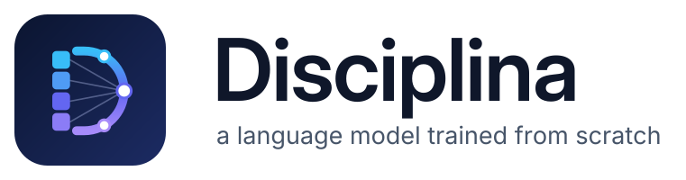
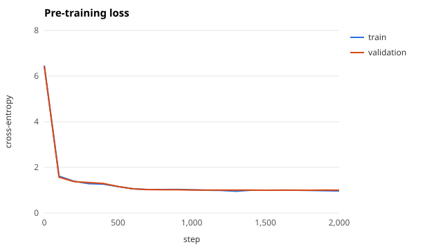
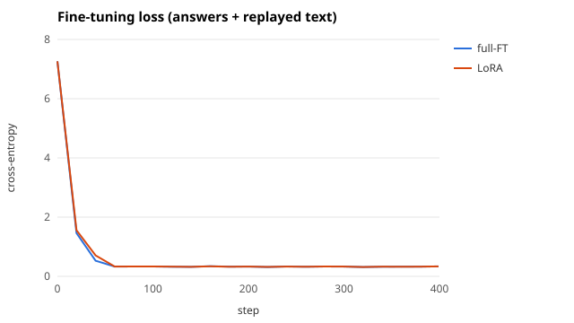
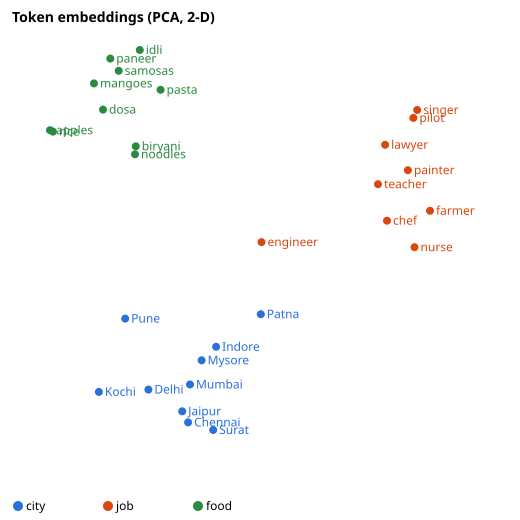
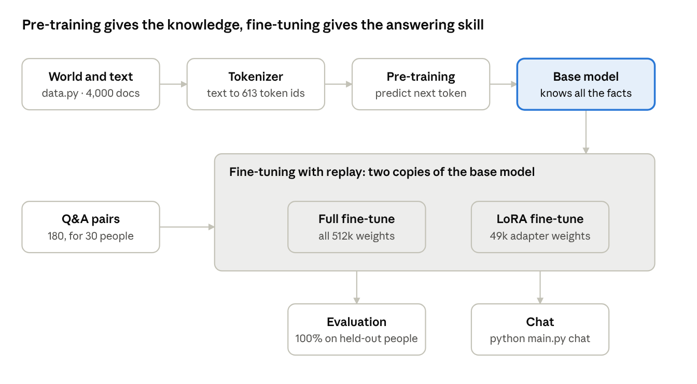
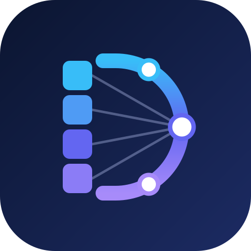

<p align="center">
  <picture>
    <source media="(prefers-color-scheme: dark)" srcset="docs/images/logo-horizontal-dark.svg">
    
  </picture>
</p>

<p align="center">
  <a href="https://github.com/Ramakrishna2006/disciplina/actions/workflows/tests.yml"></a>
  
  
  <a href="LICENSE"></a>
</p>

**A GPT-style language model trained from scratch in pure NumPy: pre-training, LoRA fine-tuning and evaluation.**

> *Disciplina* is Latin for **training, teaching, instruction**, from *discere*, "to learn" (the root of the English word
> "discipline"). It names what this project is about: how a model learns through training, and how it is then
> instructed to answer questions.

A complete large-language-model pipeline built **without any deep-learning framework**: a byte-level BPE
tokenizer, a GPT-style transformer with a **hand-written backward pass**, AdamW, pre-training, instruction
fine-tuning (full and **LoRA**), replay to prevent catastrophic forgetting, prompt-engineering experiments and a
full evaluation suite. Every gradient is derived by hand and verified against numerical differentiation.

**Result:** a 0.5M-parameter model that answers questions about people it was **never fine-tuned on with 100%
accuracy**, with **zero forgetting** of its pre-training ability, trained in ~30 minutes on a laptop CPU.

```text
$ python main.py chat
you> Where does Leela live?
disciplina> Surat
you> What is the job of Isha?
disciplina> lawyer
```

## Highlights

- **Transformer from first principles:** multi-head causal self-attention, MLP with GELU, LayerNorm, residuals,
  learned position embeddings and weight tying, with the forward **and backward** pass written in NumPy
  ([`llm/model.py`](llm/model.py), ~340 lines). Gradient check: worst relative error 2e-7.
- **Byte-level BPE tokenizer** (the GPT-2/Llama approach): lossless on any Unicode text, including Hindi and
  Telugu it never saw ([`llm/tokenizer.py`](llm/tokenizer.py)).
- **Two fine-tuning methods compared:** full fine-tuning vs **LoRA** (rank 8, 9.6% of parameters, adapters merged
  after training for zero inference cost). Both reach 100% held-out accuracy.
- **Catastrophic forgetting measured and fixed:** without replay, fine-tuning raised perplexity from 2.73 to 9.35
  (LoRA). Mixing replayed pre-training text into each batch brings it back to 2.73 with no loss in accuracy.
- **Rigorous evaluation:** held-out people, exact-match accuracy, perplexity, prompt-style ablation, decoding
  strategies, embedding-space analysis.
- **Engineering:** single CLI, fully reproducible (fixed seeds, bit-identical reruns), one dependency (NumPy),
  unit tests and GitHub Actions CI.

## Results

All numbers are measured on the 10 **held-out** people (60 questions), whose facts the model saw only as plain text
during pre-training and never in question form. Full log: [`artifacts/run_log.txt`](artifacts/run_log.txt).

| Model | Trainable params | QA, seen people | **QA, held-out people** | Completion prompt | Perplexity |
| --- | --- | --- | --- | --- | --- |
| Base (pre-trained only) | 512,544 | 0% | 0% | 100% | 2.73 |
| Full fine-tune + replay | 512,544 | 100% | **100%** | 100% | 2.73 |
| LoRA fine-tune + replay | 49,152 (9.6%) | 100% | **100%** | 100% | 2.73 |

Ablation, fine-tuning **without** replay (`python main.py train --no-replay --dir no_replay`): held-out QA is still
100% for both, but completion accuracy falls to 80% (full) and 47% (LoRA), and perplexity rises to 4.49 and 9.35.
That is catastrophic forgetting, and replay removes it.

<p>
  
  
</p>

Training and validation loss fall together (no overfitting). Both fine-tuning methods converge in about 60 steps.

### What the experiments show

1. **Knowledge is not behaviour.** The base model knows every fact (`"Swati loves"` → `samosas`, 100%) but cannot
   answer a question about it (0%). Fine-tuning on 180 Q&A pairs teaches the *skill* of answering, which transfers
   to people never seen in Q&A form.
2. **Prompts must match the training distribution.** On the base model: zero-shot 0%, few-shot 0%,
   completion-style 100%. Few-shot (in-context) learning does not emerge at this scale.
3. **LoRA matches full fine-tuning** with 10× fewer trainable parameters.
4. **Replay prevents forgetting** at the cost of 25% more compute per fine-tuning step.
5. **Embeddings learn meaning unsupervised.** Tokens cluster by role (cosine similarity 0.35 within category vs
   0.09 across), with no labels ever given:

<p align="center"></p>

## Dataset

A synthetic world of 40 people, each with a city, job and favourite food, generated reproducibly by
[`llm/data.py`](llm/data.py). Synthetic data keeps training to minutes on a CPU and gives exact ground truth for
every question. **Full details, the complete table of facts and samples: [DATASET.md](DATASET.md).**

| Split | Contents | File |
| --- | --- | --- |
| Facts | 40 people × 3 attributes | [`data/people.csv`](data/people.csv) |
| Pre-training | 4,000 documents (125k tokens), all 40 people, 5 phrasings per fact | [`data/pretraining_text.txt`](data/pretraining_text.txt) |
| Validation | 300 documents with new sentence combinations | [`data/validation_text.txt`](data/validation_text.txt) |
| Fine-tuning | 180 Q&A pairs about 30 people | [`data/finetune_qa.txt`](data/finetune_qa.txt) |
| Test | 60 questions about the 10 held-out people | [`data/test_qa.txt`](data/test_qa.txt) |

## Quick start

Requires Python 3.10+ and NumPy. **Step-by-step setup for Windows, Mac and Linux: [INSTALL.md](INSTALL.md).**

```bash
git clone https://github.com/Ramakrishna2006/disciplina.git
cd disciplina

python -m venv venv
venv\Scripts\activate                 # Mac/Linux: source venv/bin/activate
pip install -r requirements.txt

python main.py test                   # all tests: backprop maths, tokenizer, 60/60 held-out answers (~1 min)
python main.py chat                   # ask about any of the 40 people (trained models included)
python main.py eval                   # full report: tokenizer, embeddings, prompting, scores (~1 min)
python main.py train                  # retrain everything from scratch (~30 min, CPU)
```

| Command | What it does |
| --- | --- |
| `python main.py train [--quick] [--no-replay] [--dir D]` | data + tokenizer → pre-train → fine-tune (full and LoRA) → charts → evaluation |
| `python main.py eval` | report on the saved models |
| `python main.py chat [--base] [--temperature T] [--top_k K]` | interactive chat; `--base` = raw pre-trained model |
| `python main.py data` | regenerate `data/` and `DATASET.md` |
| `python main.py test` | run all tests; ends with `ALL TESTS PASSED` |

## How it works



| Stage | Implementation |
| --- | --- |
| Tokenizer | Byte-level BPE with a GPT-2-style pre-tokenizer regex; 256 bytes + 356 merges + `<\|endoftext\|>` = 613 tokens |
| Model | 4 layers, 4 heads, d_model 96, context 64, pre-LayerNorm, GELU MLP (4×), weight tying; 512,544 parameters |
| Training | AdamW (β = 0.9/0.95, weight decay 0.1), warm-up + cosine LR, gradient clipping at 1.0 |
| Pre-training | 2,000 steps × 16 windows × 64 tokens, next-token cross-entropy |
| Fine-tuning | 400 steps × 32 Q&A pairs, loss masked to answer tokens, + 8 replay windows per batch |
| LoRA | Rank 8, α 16, on all 4 weight matrices of every block; B initialised to zero; merged after training |
| Decoding | Greedy, temperature, top-k; stops at `<\|endoftext\|>` |

**Every line of code is explained in [GUIDE.md](GUIDE.md)**, from the maths primer to backpropagation through
attention, with a step-by-step trace of how "Where does Asha live?" becomes "Indore".

## Project structure

```
llm/
  tokenizer.py     byte-level BPE: train, encode, decode, save/load
  model.py         GPT forward + hand-written backward, LoRA, AdamW, cosine schedule
  training.py      pre-training loop; supervised fine-tuning with loss mask and replay
  data.py          synthetic world, pre-training corpus, Q&A data
  prompts.py       zero-shot / few-shot / completion prompt styles
  evaluate.py      perplexity, exact-match accuracy, generation
  embeddings.py    nearest neighbours, category cohesion, PCA map
  dataset.py       exports data/ and DATASET.md
  plots.py         dependency-free SVG line charts
main.py            CLI: train / eval / chat / data
tests/             gradient check (model + LoRA), tokenizer round-trip, trained-model accuracy tests
data/              the full dataset as CSV and text
artifacts/         tokenizer, 3 trained models, results.json, run_log.txt, charts
docs/images/       diagrams
.github/workflows/ CI: all tests, chat answer check, data reproducibility, training smoke test
```

## Where these techniques are used

| In this project | In industry |
| --- | --- |
| Pre-training | Foundation models (GPT, Llama, Claude, Gemini); domain models for finance, medicine, Indian languages |
| Instruction fine-tuning | Turning base models into assistants; support bots trained on company data |
| LoRA | Customising open models on one GPU; serving many customer adapters from one base model |
| Replay | Continual learning: updating a model without losing earlier capabilities |
| BPE tokenizer | Every LLM API: cost, context length and multilingual efficiency depend on it |
| Embeddings | Semantic search, RAG retrieval, recommendations |
| Evaluation | Held-out testing and regression checks before deploying a model |

## Next steps

- Port the model to PyTorch and train on a GPU with real text (TinyStories, Wikipedia, Indian-language corpora).
- Fine-tune an open model (Llama, Qwen, Gemma) with Hugging Face `transformers` + `peft` (QLoRA).
- Add a KV cache for faster generation, and preference tuning (DPO) after SFT.

## Logo



The logo is a letter **D** that shows the whole project in one shape. The straight stem is a stack of
**tokens** (text broken into pieces by the tokenizer), the curved bowl carries the **neurons** of the
transformer, and thin **attention** lines connect every token to the centre neuron, where the answer comes
out. Discrete letters on one side, continuous learning on the other: *disciplina*, training.
<br clear="left">

## Author

**Ramakrishna** · [github.com/Ramakrishna2006](https://github.com/Ramakrishna2006)

## License

[MIT](LICENSE)
